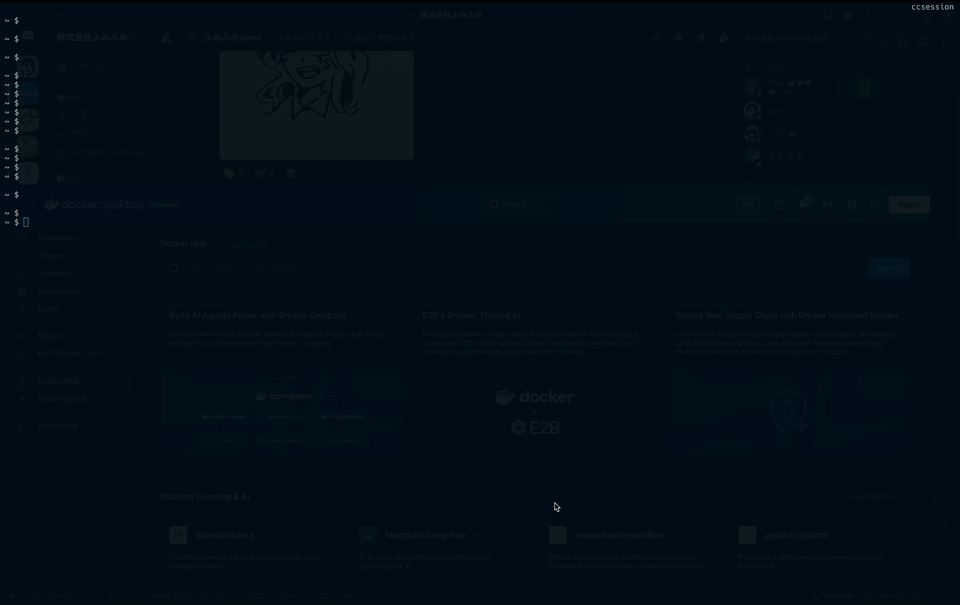

# ccsession

> An fzf-powered session picker for `claude --resume`.



`ccsession` lists every Claude Code session under `~/.claude/projects`, lets
you fuzzy-find across all of your projects with a live preview pane, and
resumes the one you pick in its original working directory.

## Features

- **Cross-project listing** — every session from every project in one view,
  sorted by last activity.
- **Three search modes** — fuzzy (default), directory-only, and full-text
  grep over JSONL transcripts, with configurable mode-switch keys.
- **Live preview** — last 30 messages of the highlighted session, with
  timestamps and roles. In grep mode the matched query is highlighted in the
  preview so you can spot the hit at a glance.
- **Faithful resume** — `chdir`s back to the session's original `cwd` before
  exec'ing `claude --resume`, so paths and tooling Just Work.
- **Single static binary** — written in Go; the only dependency is a small
  TOML parser for the optional config file.

## Requirements

| Tool | Required for |
| --- | --- |
| [`fzf`](https://github.com/junegunn/fzf) `>= 0.58.0` | interactive picker |
| `claude` ([Claude Code CLI](https://docs.claude.com/en/docs/claude-code)) | resuming sessions |

`ccsession` depends on newer `fzf` actions such as `transform`, `rebind`,
`unbind`, `disable-search`, and `change-nth`. The newest of those,
`change-nth`, landed in `fzf 0.58.0`, so older versions may start but the mode
switch bindings will not work correctly.

## Install

### Go

```sh
go install github.com/sorafujitani/ccsession/cmd/ccsession@latest
```

Version metadata is recovered from `runtime/debug.ReadBuildInfo`, so
`ccsession --version` works for `go install` builds as well.

### Pre-built binaries

Grab the `ccsession_<ver>_<os>_<arch>.tar.gz` for your platform from the
[Releases](https://github.com/sorafujitani/ccsession/releases) page, extract
it, and drop the binary somewhere on your `PATH`:

```sh
tar xzf ccsession_0.1.0_darwin_arm64.tar.gz
install -m 0755 ccsession ~/.local/bin/
```

If macOS Gatekeeper complains:

```sh
xattr -d com.apple.quarantine ~/.local/bin/ccsession
```

### Nix flake

```sh
nix run github:sorafujitani/ccsession             # one-off
nix profile install github:sorafujitani/ccsession # install into a profile
```

### Homebrew

```sh
brew install sorafujitani/tap/ccsession
```

The formula lives in
[`sorafujitani/homebrew-tap`](https://github.com/sorafujitani/homebrew-tap)
and GoReleaser refreshes it on every tagged release. `fzf` is installed as a
dependency; the `claude` CLI must be installed separately.

## Usage

```sh
ccsession                            # list -> fzf -> resume
ccsession list  [--grep Q] [--regex] # emit TSV rows to stdout
ccsession preview [--query Q] [--regex] <id> # render the preview pane (Q highlighted)
ccsession resume  <id>               # chdir to the session's cwd, exec `claude --resume`
ccsession --version
ccsession --help
```

### Keys inside fzf

| Key      | Mode |
| -------- | --- |
| `Ctrl-G` | grep — refilters by user/assistant content on every keystroke; matches are highlighted in the preview |
| `Ctrl-O` | dir — fuzzy match restricted to the directory column |
| `Ctrl-F` | fuzzy — default; matches across time / dir / label |
| `Enter`  | resume the selected session |
| `Esc`    | cancel |

The three mode-switch keys are the defaults and can be overridden (see below).

### Configuring the keybindings

If a mode-switch key clashes with your terminal, shell, or muscle memory, you
can remap any of the three. Keys are resolved in this order (first wins):

**CLI flags > environment variables > config file > defaults**

The on-screen header is regenerated from the resolved keys, so the hint always
matches what is active.

```sh
# CLI flags (highest precedence)
ccsession --bind-grep ctrl-r --bind-fuzzy alt-f

# environment variables
export CCSESSION_BIND_GREP=ctrl-r
export CCSESSION_BIND_DIR=ctrl-o
export CCSESSION_BIND_FUZZY=alt-f
```

Config file at `~/.config/ccsession/config.toml` (lowest precedence before
defaults; honors `XDG_CONFIG_HOME`). ccsession only **reads** this file — it
never creates it, so create it yourself only if you want file-based overrides:

```toml
[keybindings]
grep  = "ctrl-r"
dir   = "ctrl-o"
fuzzy = "alt-f"
```

Any key you leave unset falls through to the next source. A key name must be
lower-case fzf syntax (`ctrl-r`, `alt-f`, `f1`, …); the three keys must be
distinct and must not be a reserved fzf event name (`enter`, `change`, …), or
ccsession exits with an error instead of starting the picker.

## How it works

1. `ccsession list` walks `~/.claude/projects/*/`, reads the tail of each
   JSONL transcript in parallel, and prints one TSV row per session
   (`id`, `epoch`, relative time, cwd basename, label).
2. `fzf` consumes the TSV. The three key bindings swap fzf's matcher
   between fuzzy mode, directory-only mode, and grep mode (which reloads
   via `ccsession list --grep <query>` on every keystroke). The current
   query is also forwarded to the preview as `ccsession preview --query
   <query> <id>`, which highlights its matches in the rendered messages.
3. On `Enter`, `ccsession resume <id>` resolves the session's original
   `cwd`, `chdir`s into it, and `execve`s `claude --resume <id>` so the
   resumed process fully replaces the picker.

## Development

```sh
nix develop                    # Go + fzf + gopls + goreleaser
go build ./cmd/ccsession
go test ./...
```

### Snapshot a release locally

```sh
goreleaser release --snapshot --clean --skip=publish
ls dist/
```

### Build with Nix

```sh
nix build
./result/bin/ccsession --version
```

## Contributing

Bug reports and pull requests are welcome at
<https://github.com/sorafujitani/ccsession>. For larger changes, please
open an issue first to discuss what you'd like to change.

## License

[MIT](./LICENSE)
